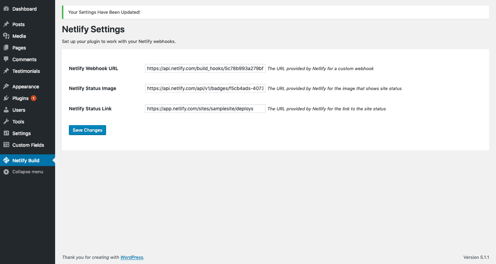
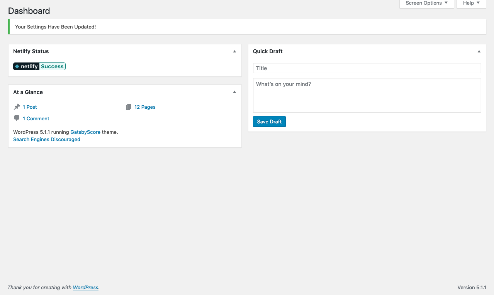

# WP Trigger Netlify Build

This plugin was built to make it easier for developers to use WordPress as a headless CMS. It makes it a breeze to trigger builds in [Netlify](https://www.netlify.com/) whenever content is created or updated.

## Installation

You can download the .zip file from [the github repo](https://github.com/iamtimsmith/wp-trigger-netlify-build.git) or clone the repository into the plugins folder using the following code.

```
git clone https://github.com/iamtimsmith/wp-trigger-netlify-build.git
```

Next you have to install and activate the plugin within the wordpress admin. Once activated, grab the webhook url from Netlify and enter it into the plugin settings page. Next you can grab the status image url and link url to drop into the settings which will provide the netlify status banner in the WordPress dashboard.

## Screenshots

<figure>
  
  <figcaption>Settings page in WordPress admin</figcaption>
</figure>

<figure>
  
  <figcaption>Dashboard with Netlify status</figcaption>
</figure>
